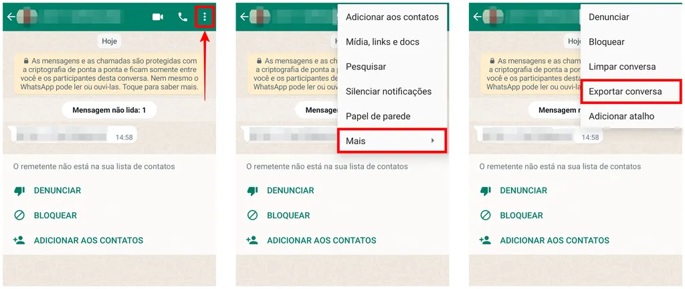
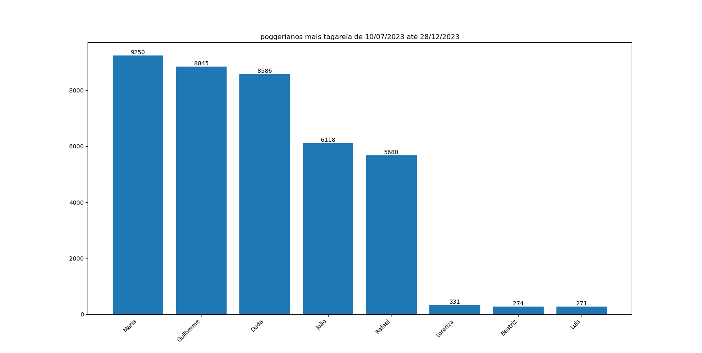

## Contador de mensagens no Whatsapp
<div align="center">
  
[](https://github.com/me15degreesm/interface-calculadora-rendimento)
[](https://www.python.org/)
  
</div>

Este script em Python permite gerar um gráfico que mostra as pessoas que mais conversam (número absoluto) em um determinado intervalo de tempo com base nos dados de uma conversa exportada de um grupo no WhatsApp. Até a última atualização, a exportação não é feita através do WhatsApp Web. Certifique-se também que o arquivo a ser lido e que deve ser renomeado no script, esteja na mesma pasta que o código `script_zap.py`.
## Como exportar?
Para usuários de android (Canaltech):



Para usuários de IOS (Canaltech):


## Resultado
O resultado final deve ficar assim, com pequenas variações de acordo com o que você selecionou para o grupo/chat. A imagem já é salva automaticamente na pasta Downloads, mas você pode alterar o caminho de salvamento ou desabilitar o salvamento automático.



## Instalação
Siga estes passos para configurar e executar o script:

1. Clone o repositório:

   ```bash
   git clone https://github.com/me15degrees/count-messages-for-whatsapp.git
   cd count-messages-for-whatsapp
   ```
2. Verifique os requirements:
   ```bash
   pip install -r requirements.txt
    ```
3. Exporte a conversa de um grupo do WhatsApp como um arquivo de texto:<br></br>Você pode fazer isso indo para o grupo no WhatsApp, clicando nos três pontos no canto superior direito, selecionando "Mais" e escolhendo "Exportar chat". Guarde o arquivo exportado no diretório do projeto com o nome, por exemplo: poggers.txt.
4. Execute o comando:
   ```bash
   python script_zap.py
    ```
## Próximas Implementações
O próximo passo vai ser tornar o script em python mais flexível e com uma maior usabilidade. Para isso melhorias que eu pensei de serem feitas são:

[ ] Quantidade do ranking

Para grupos de muitas pessoas é interessante passar como parâmetro o número máximo do ranking (exemplo: top 3, top 5).

[x] Seleção de intervalos personalizados

Entendo que diferentes usuários podem ter necessidades específicas ao analisar suas conversas. Por isso, quero implementar a capacidade de selecionar intervalos temporais no código no formato `dia/mês/ano`.

[x] Tirar a sobreposição de pessoas com mesmo 1º nome

Para isso é necessário printar o primeiro e segundo nome, mas com uma inclinação de 45º.

Outro detalhe é que a imagem já é salva em uma pasta que pode ser alterada no código.

##

<div align="center">
Follow me:
  
  [](https://www.linkedin.com/in/maria-eduarda-nascimento-andrade-bb0b86213/)
  [](https://www.youtube.com/channel/UCh6sgz1ij_my64lX8rQnPXg)
  [](https://open.spotify.com/user/223w3q4xdm4pquahzl5xhfpia?si=t08g7SlVRvqhF0LseXTyXg&nd=1&dlsi=87356229bcf14264)
  [](https://www.last.fm/user/me15degrees)
  

</div>

